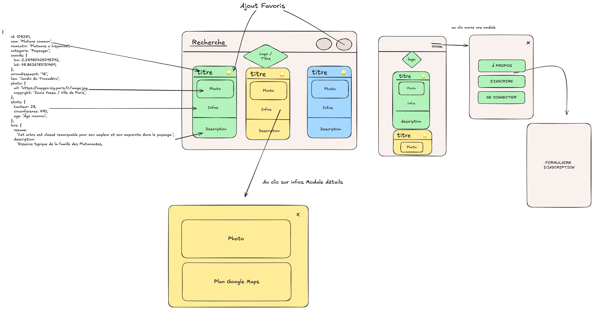
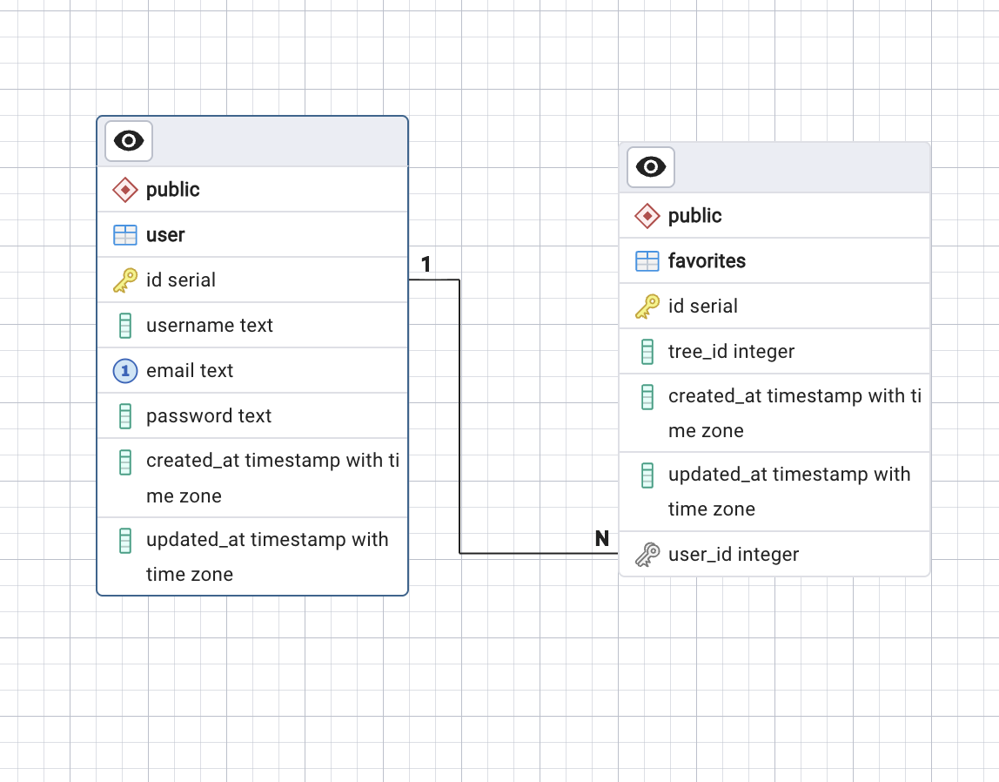
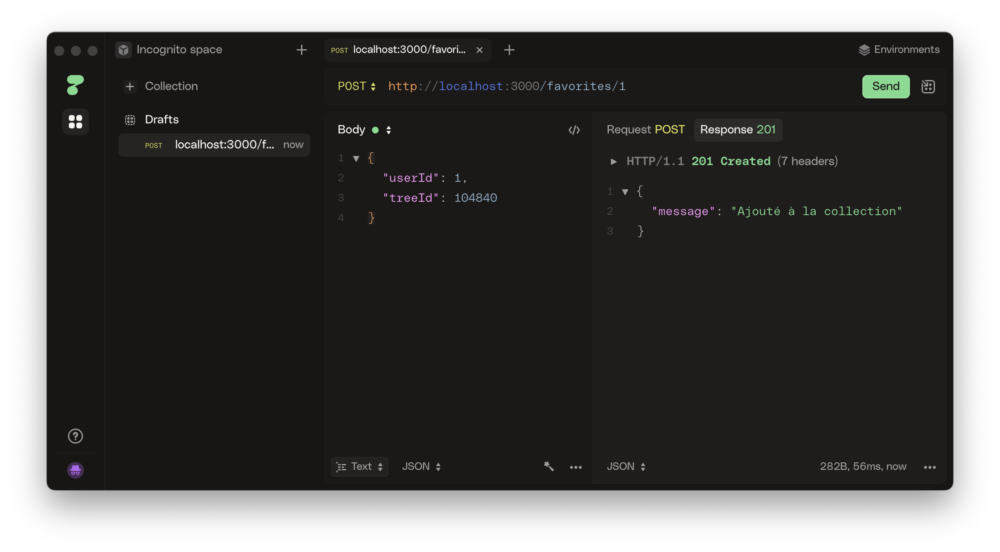

# TCG Explorer – Les Arbres Remarquables de Paris

## Introduction

L'idée était de sortir des cartes Pokémon habituelles et de faire un truc un peu plus fun. J'ai un projet d'application "historique" sur Paris et j'aime l'idée de gamifier certains lieux. Ça fait un moment que je connais l'existence de l'API des arbres remarquables parce que certains m'ont intrigué sur l'Open Data de Paris ; la carte en ligne est bien faite, mais je n'avais jamais vu en détail comment elle fonctionnait.

* **Front-end (Client) :** [Lien Cloudflare Pages](https://frontend-card.cloudflare-mqkhv.workers.dev/)

* **Back-end (API) :** [https://treecard-backend.onrender.com](https://treecard-backend.onrender.com)
> *Hébergé sur Render. *Hébergé sur render (attendre que le serveur démarre environ 30s avant de lancer le front)*


## Gestion de projet: 

### 📅 Planning de suivi du projet (Sprints sur 1 mois)

| Semaine | Phase | Tâches principales |
| --- | --- | --- |
| **Semaine 1** | **Conception & Cadrage** | Étude de l'API ODS (OpenDataSoft), création du zoning/wireframes, setup des environnements Front (Vite) et Back (Express). |
| **Semaine 2** | **Développement Back-end** | Configuration Sequelize/Postgres, création des modèles User/Favorite, proxy API pour les données de Paris. |
| **Semaine 3** | **Développement Front-end** | Intégration Tailwind, composants `TreeCard`, filtres de recherche ODSQL, modale Google Maps & Photos. |
| **Semaine 4** | **Finalisation & Sécu** | Auth JWT, gestion des favoris, responsive design, conformité RGPD (cookies Maps) et documentation client. |
|**Fin de mois** | **Mise en ligne** | Déploiement (Render/Vercel/Railway), configuration DNS et environnement de production. |

---

### Budget prévisionnel (Prestation Freelance)

*Basé sur un TJM **300€**.*

| Tâche principale | Durée estimée | Coût estimé (HT) |
| --- | --- | --- |
| **Conception & UX/UI** (Zoning, choix API, architecture) | 2 jours | 600€ |
| **Développement Back-end** (API, Sequelize, Auth JWT) | 5 jours | 1 500€ |
| **Intégration Front-end** (React, Tailwind, Cartographie) | 7 jours | 2 100€ |
| **Logique métier & Favoris** (CRUD, filtres complexes) | 3 jours | 900€ |
| **Tests, Recettage & Documentation** (RGPD, README) | 2 jours | 600€ |
| **Déploiement & Mise en ligne (Ops, config serveur)** | 1,5 jour | 500€ |
| **TOTAL GÉNÉRAL** | **20,5** | **6150-6200€** |

---

## Conception

### User Stories

| En tant que... | Je dois pouvoir... | Afin de... |
| --- | --- | --- |
| **Utilisateur** | Explorer la liste des arbres remarquables | Découvrir le patrimoine naturel de Paris. |
| **Utilisateur** | Filtrer par arrondissement ou par essence | Trouver un arbre spécifique près de chez moi. |
| **Utilisateur** | Cliquer sur un arbre pour voir sa fiche | Consulter sa photo, son histoire et sa position GPS. |
| **Visiteur** | Créer un compte sécurisé | Sauvegarder mes découvertes. |
| **Utilisateur connecté** | Ajouter un arbre à mes "favoris" | Le retrouver facilement sur mon profil. |
| **Utilisateur connecté** | Supprimer un favori | Gérer ma collection personnelle. |

### Zoning / Wireframes


### Modèle de données (MCD)


### Tests d'API (Screenshots)



### État du projet & Retours d'expérience

J'ai passé trop de temps à hésiter et réfléchir sur le type d'API, et pas assez de temps sur le front : j'ai construit et déconstruit des choses pour aller vite. J'aurais dû commencer le projet plus tôt, mais j'avais des tests techniques à préparer Jeudi et vendredi. 

---

## 💻 Côté Front-end

**Stack :** React, Vite, Tailwind CSS, Axios.

### Ce qui est fonctionnel :

* **Visualisation :** Affichage des cartes opérationnel.
* **Tri et recherche :** Système de filtrage fonctionnel.
* **Détails :** Consultation des spécificités de chaque carte.
* **Modale interactive :** Intégration de Google Maps et affichage de la photo de l'arbre en modale.

### Ce qui reste à faire / pas commencé :

* Gestion du login et de l'ajout en favoris côté front (projet d'ajouter une icône en haut à droite de chaque carte).
* Ajout de sélecteurs avancés : arbres par taille, par âge ou par arrondissement.
* **RGPD :** Mettre un warning sur les cookies de Google Maps avant d'ouvrir la modale et charger la carte.
* Séparer plus proprement les appels API du reste du code.

---

## ⚙️ Côté Back-end

**Stack :** Node.js, Express, Sequelize, PostgreSQL, JWT, Dotenv.

L'objectif est d'avoir une API qui renvoie au front des endpoints pour se connecter, gérer les favoris, et effectuer des recherches.

### Structure & Fonctionnalités :

* **Endpoints :** Recherche, consultation par catégories, gestion des comptes.
* **Sécurité :** Routes d'ajout/suppression de favoris passant par un middleware JWT.
* **Open Data :** Les endpoints utilisent l'Open Data Soft Query Language (ODSQL). C'est très proche du SQL, ce qui permet d'améliorer les requêtes avec des `GROUP BY` ou des clauses `WHERE` précises (ex: `where="espece='Platane' AND arrondissement='75015'"`).

### Axes d'amélioration :

* Factoriser la fonction de formatage d'un arbre avec le `map` pour respecter le **DRY**, ainsi que les vérifications d'utilisateur.
* Mettre en place une base de données de remplacement (un scraping petit à petit à chaque appel de carte).
* Ajouter des validations de contenu utilisateur et une vérification de compte par mail avec **Nodemailer**.
* Prévoir la prise en charge de nouvelles essences d'arbres (au cas où Paris plante des palmiers !).
* Commit faits sur le backend mais pas le front end


---

## 🛠 Usage de l'IA & Sources

* **IA :** Utilisée pour la réflexion sur une partie de la structure, le debug des props, certaines classes Tailwind, des suggestions de couleurs, et la correction de bugs sur les modales. Côté back, elle a aidé sur le debug de typos dans mes requêtes et la mise en forme du texte du README.
* **Inspiration :** Je me suis inspiré de projets similaires faits en formation (notamment pour le scaffolding Sequelize, le seed, la structure React etc.).

---

## 📂 Structure des fichiers

**Front-end :**

```text
./src
./src/components (TreeCard, Navbar)
./src/pages (Home, Favorites)
./src/utils (Axios config)

```

**Back-end :**

```text
./app/controllers (auth, tree, user)
./app/middlewares (authMiddleware)
./app/models (user, favorites)
./app/config (database, jwt)
./app/scripts (seed.js)

```

---
